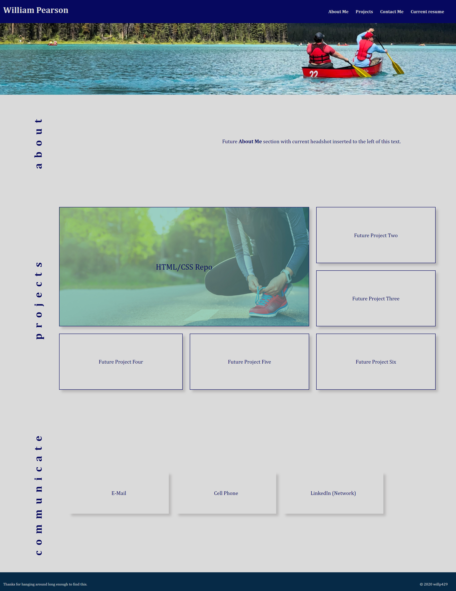

# Web Development Portfolio
## Overview
- Created skeleton/template of Portfolio layout with HTML and CSS structure
- Future tasks include optimization and adding of Javascript to allow a deeper UX

## Web skills use include:
- HTML
- Advanced CSS - flexboxes, grid layout and attempted media queries

## Future tasks:
- Add background image (visually pleasing)
- Add headshot (format as an oval?)
- Add about me/objective
- Update resume to include web development work
- Change color schemes
- Post live Run Buddy page (figure out why an old commit is live)
Structure changes:
- Optimize CSS classes
- Focus on media queries

## Screenshot
